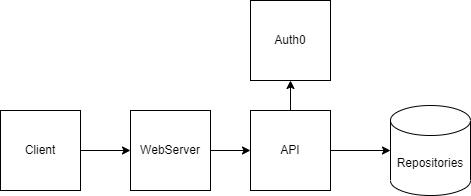
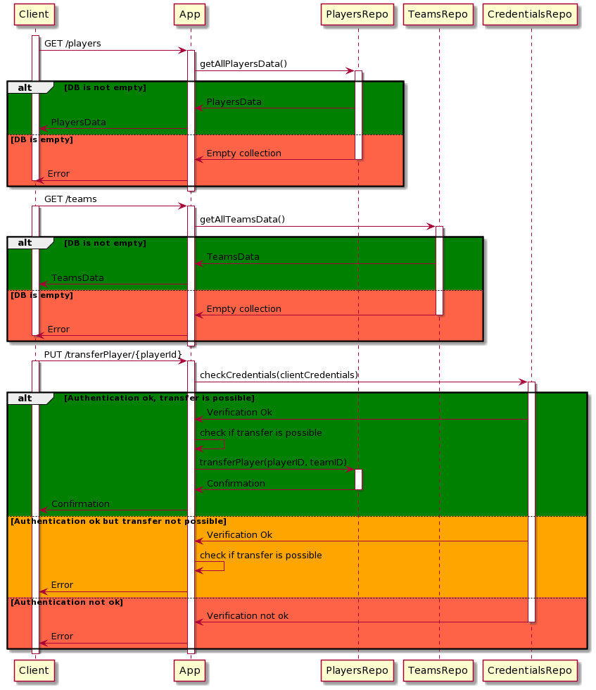

## Author
Andrii Kmet

## Application Assumptions
The created application allows for browsing, adding, and changing the club affiliation of players from the Polish football league.

The database will store players. A single player will include their personal data (first name, last name, age, nationality, height), club affiliation, and statistics (position on the field, goals, assists, yellow and red cards).

Each user will have the ability to view data on all players, a specific player by providing their ID, and retrieve information about all players from a specific team by providing the team ID.

Only authorized users will be able to add new players or update their data and statistics.
An authorized user can also perform transfers, meaning moving a player from one team to another by providing the player's ID and the new team.
Additionally, an authorized user can delete a player from the database.

The application will enable the execution of the following functions:

1. **GET -> /players**		-> Returns data for all players in the database.

2. **GET -> /player/{ID}**  	-> Returns data for the player with the specified ID..

3. **GET -> /teams**            -> Returns data for all teams.

4. **GET -> /team/{ID}**    	-> Returns data for all players in the specified team.

5. **POST -> /player** 	-> Creates a new player. Authorization required. All details provided in the request body.

6. **PUT -> /transferPlayer/{ID}** -> Transfers a player to a new team. The new team details are provided in the request body. Authorization required.

7. **DELETE -> /player/{ID}**	-> Deletes a player from the database. Authorization required.

**Authorization Basic**:
**login**: admin
**password**: admin

A page to generate an HMAC digest: 
https://www.devglan.com/online-tools/hmac-sha256-online

# Aplication Diagrams
# Architecture Diagram

# Case (Transfer Player)

